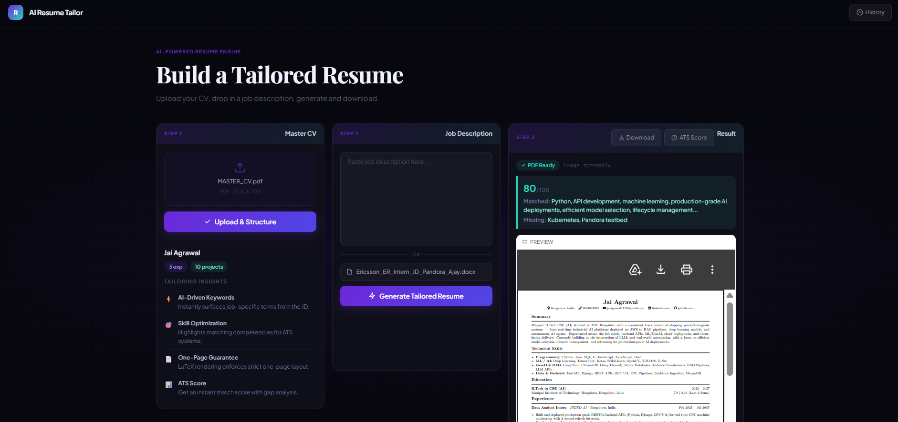

# AI Resume Tailor

Converts a master CV + a target job description into a tailored, ATS-optimized,
strictly one-page LaTeX resume — compiled to PDF, scored against the JD, and
self-corrected in a feedback loop until it fits one page.

## Stack
- Frontend: React + Vite + TailwindCSS
- Backend: FastAPI (Python 3.11)
- AI: Groq (`llama-3.3-70b-versatile`)
- Rendering: Jinja2 → fixed LaTeX template → `pdflatex` (TeX Live, in Docker)
- Validation: PyPDF2 page-count check
- Storage: SQLite (multi-user-ready schema)

## Screenshots

### Dashboard — ready to tailor
.png)

### Dashboard — resume generated with PDF preview


## The Hardest Problem: Guaranteeing Exactly One Full Page

The single biggest engineering challenge in this project was making the tailored resume
reliably fit **exactly one page** — not spilling onto two, and not leaving noticeable
white space at the bottom. What sounds like a simple constraint turned out to have
multiple compounding failure modes.

### Why it was hard

**1. The AI doesn't reliably follow budget instructions.**
The tailoring prompt specified exactly 3 projects, 2–3 experience entries, and 1
leadership entry. In practice, the model would return 2 projects instead of 3,
skip the leadership section entirely, or include all 8 skill categories with every
skill it knew about. No amount of prompt engineering made this 100% reliable —
LLMs are probabilistic, not deterministic.

**2. PyPDF2 lied about the page count.**
The page-check loop used PyPDF2 to count pages after compilation. The assumption
was: if PyPDF2 says 1 page, we're done. This turned out to be wrong. LaTeX was
cramming content past the bottom margin — technically still "one page" in PDF
metadata, but visually rendering as two pages in the browser. The trim loop saw
`page_count == 1` and did nothing, letting the overflow through silently.

**3. AI-based retries compounded the problem.**
When the page was underfilled, an `expand_cv()` call re-prompted the model to
add content back. But this new AI response would again ignore budget rules —
overwriting the deterministic fixes that had just been applied earlier in the
pipeline. The expand loop was undoing its own predecessor's work.

**4. Unicode characters broke pdflatex.**
Your CV contained `∼` (U+223C, TILDE OPERATOR) in bullets like "∼80% latency
improvement". The LaTeX escaper only handled plain ASCII `~`. pdflatex would
fail silently on the Unicode character, surfacing as a cryptic compile error
rather than an escaping issue.

**5. Name mismatch killed the project deduplication.**
The AI would shorten project names (returning `"ForgeMind AI"` when the master
CV had `"ForgeMind AI — Industrial Machine Monitoring Platform"`). The
deduplication check used exact string equality, so it saw them as different
projects and added the full-name version on top of the shortened one — giving
you 2 real projects plus a duplicate, not 3 unique ones.

### How it was solved

The fix was recognising that **AI reliability and LaTeX layout accuracy are two
separate problems that need separate solutions** — you can't solve a layout
constraint with a prompt.

**For content budget:** a deterministic Python function `ensure_min_content()`
runs as the absolute last step in the pipeline, after all AI calls have finished.
It enforces hard caps directly on the data structures — no model call involved:
- Skills: max 4 categories, max 7 items each
- Experience: max 3 entries, max 2 bullets each
- Projects: exactly 3 entries, max 2 bullets each (pads from master CV if short)
- Leadership: exactly 1 entry, description capped at 180 characters

Because this runs last, no subsequent AI call can overwrite it.

**For project deduplication:** switched from exact string equality to substring
containment — if either name contains the other, they're treated as the same
project. `"ForgeMind AI" in "ForgeMind AI — Industrial Machine Monitoring Platform"`
is `True`, so no duplicate gets added.

**For Unicode:** added a pre-processing pass to `escape_latex()` that converts
known Unicode characters (∼, —, curly quotes, ellipsis, accented letters) to
safe ASCII equivalents before the standard LaTeX escape map runs.

**For the trim loop:** the PyPDF2 page-count approach was kept but is now a
backstop rather than the primary defence. The real fix is preventing overflow in
the first place via the deterministic caps, rather than detecting it after the
fact and hoping the AI trims correctly.

## Project Status

- [x] Phase 0 — Project setup
- [x] Phase 1 — CV parsing (PDF/DOCX/TXT + hyperlink extraction)
- [x] Phase 2 — CV structuring (AI → canonical JSON schema)
- [x] Phase 3 — Tailoring engine (AI, JD as text or file upload)
- [x] Phase 4 — LaTeX rendering (Jinja2 template, full Unicode escaping)
- [x] Phase 5 — PDF compilation (pdflatex via subprocess, `/download/{id}`)
- [x] Phase 6 — Page-check loop (trim on overflow, deterministic content floor)
- [x] Phase 7 — ATS scoring (Groq, matched/missing keywords + suggestions)
- [x] Phase 8 — Frontend (dark UI, 3-column dashboard, inline PDF preview)
- [x] Phase 9 — Integration & hardening

## Setup

1. Copy the env template and add your **real** Groq API key
   (get one free at https://console.groq.com → API Keys):
   ```bash
   cp .env.example .env
   # edit .env — set GROQ_API_KEY=gsk_...
   ```

2. Build and start both services:
   ```bash
   docker-compose up --build
   ```

3. Visit:
   - Frontend: http://localhost:5173
   - Backend API docs: http://localhost:8000/docs
   - Health check: http://localhost:8000/health

## Repo Structure

```
Resume_Optimizer/
├── docker-compose.yml
├── .env.example
├── screenshots/
│   ├── ui_empty.png
│   └── ui_with_result.png
├── backend/
│   ├── Dockerfile
│   ├── requirements.txt
│   ├── data/                   # SQLite DB (gitignored)
│   └── app/
│       ├── main.py             # FastAPI entrypoint + all endpoints
│       ├── cv_parser.py        # Phase 1: text + hyperlink extraction
│       ├── groq_service.py     # Phase 2/3/6/7: AI calls + content guarantees
│       ├── latex_service.py    # Phase 4/5: rendering, escaping, compilation
│       ├── models.py           # Pydantic schemas (MasterCV, TailoredCV)
│       ├── db.py               # SQLAlchemy models + SQLite setup
│       ├── templates/          # Fixed LaTeX resume template
│       └── generated/          # Per-run .tex/.pdf output
└── frontend/
    ├── Dockerfile
    ├── package.json
    ├── tailwind.config.js
    ├── vite.config.js
    ├── index.html
    └── src/
        ├── App.jsx
        ├── api.js
        ├── index.css
        └── pages/
            ├── Dashboard.jsx
            └── HistoryPage.jsx
```

## Key Design Principles

- **LLM = content, Python = structure.** The model only ever returns JSON. Python
  owns all LaTeX generation, escaping, macro placement, and content budget enforcement.
- **One fixed LaTeX template** — visual consistency guaranteed; only entry content varies.
- **Deterministic floor, not AI compliance** — content budget is enforced by Python
  after all AI calls finish, not by hoping the model follows prompt instructions.
- **Multi-user-ready schema from day one** — `user_id` exists on all tables even
  though auth isn't built yet, avoiding a painful future migration.
